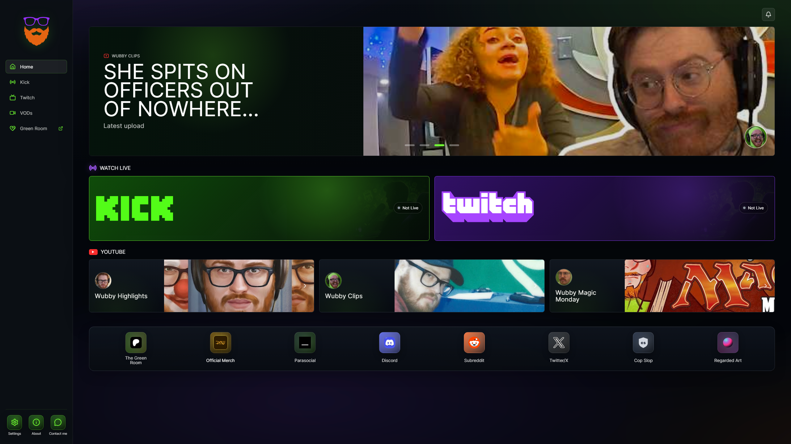
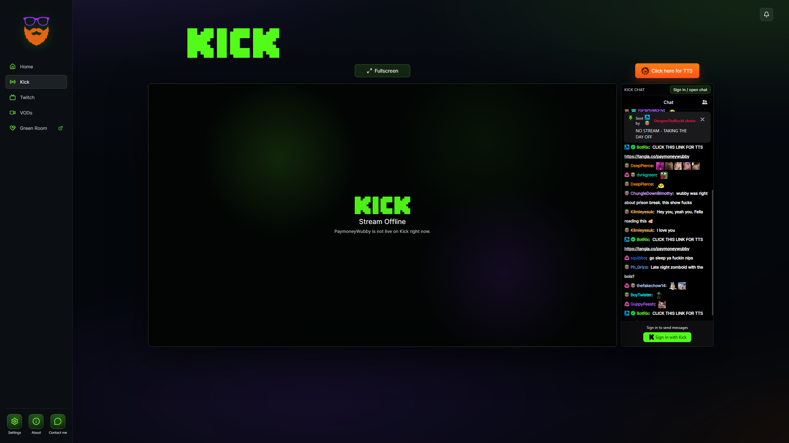
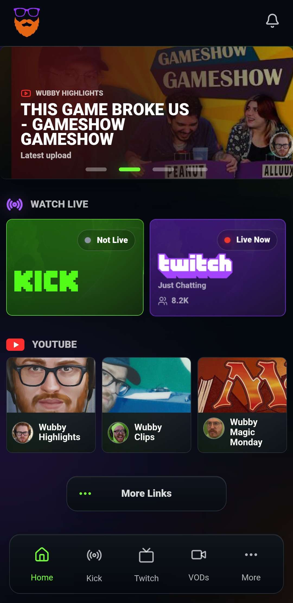
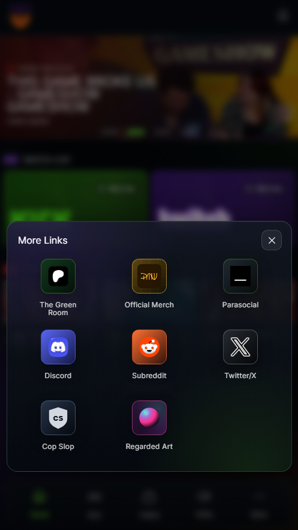
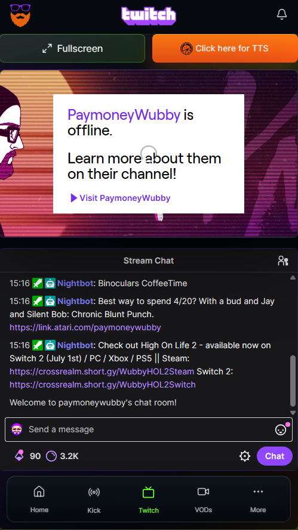

# WubHub

<p align="center">

</p>

WubHub is a community stream hub for PaymoneyWubby viewers, built with React, Vite, and Capacitor for web, Android mobile, Android TV, and iOS targets.

## Preview

### Desktop

<p align="center">
  
  
</p>

### Mobile

<p align="center">
  
  
  
</p>

## What It Does

- Watch Kick and Twitch streams from one app.
- Open stream pages with fullscreen support and embedded chat.
- View live status for Kick and Twitch.
- Receive optional live notifications for each platform.
- Browse Wubby YouTube channels and latest-video carousel cards.
- Open Parasocial VODs, official merch, The Green Room, Discord, Subreddit, and Twitter/X links.
- Use a TV-focused layout with remote-control focus states.
- Use a mobile layout with bottom navigation and live indicators.

## Platforms

- Web preview through Vite
- Android mobile through Capacitor
- Android TV through Capacitor
- iOS through Capacitor

## Requirements

- Node.js
- npm
- Android Studio / Android SDK for Android builds
- Xcode for iOS builds

## Install

```sh
npm install
```

## Run Locally

```sh
npm run dev
```

The Vite dev server runs with host access enabled so it can be tested from local devices on the network.

## Build Web Assets

```sh
npm run build
```

## Sync Capacitor

```sh
npx cap sync
```

For Android only:

```sh
npx cap sync android
```

For iOS only:

```sh
npx cap sync ios
```

## Build Android Debug APK

From the project root:

```sh
npm run build
npx cap sync android
cd android
./gradlew assembleDebug
```

The debug APK is generated under:

```text
android/app/build/outputs/apk/debug/
```

## Notes

WubHub is an unofficial community app. Platform embeds, chat login behavior, and autoplay behavior can depend on Kick, Twitch, YouTube, Android WebView, and iOS WebKit policies.
